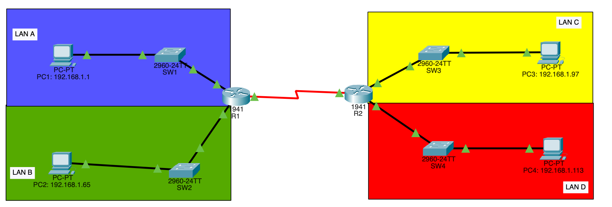

# VLSM Multi-LAN Routing Lab

Cisco Packet Tracer lab demonstrating **Variable Length Subnet Masking (VLSM)** and static routing between multiple LANs using two routers.

## Topology

## Network Design

| LAN     | Subnet              | Usable Hosts | Purpose                  |
|---------|---------------------|--------------|--------------------------|
| LAN A   | 192.168.1.0/26      | 62           | Main LAN                 |
| LAN B   | 192.168.1.64/27     | 30           | Department LAN           |
| LAN C   | 192.168.1.96/28     | 14           | Small office LAN         |
| LAN D   | 192.168.1.112/29    | 2            | Point-to-point / Server  |
| R1–R2   | 192.168.1.116/30    | 2            | Router interconnection   |

- **R1 Serial/FastEthernet IP**: 192.168.1.117
- **R2 Serial/FastEthernet IP**: 192.168.1.118

## Project Structure

- `configs/`          → Router configuration files (`R1.txt`, `R2.txt`)
- `packet-tracer-file/` → `VLSM-subnetting-start.pkt`
- `verification/`     → Ping screenshots (`pc1.png` – `pc4.png`) and `show-ip-route.txt`

## Features & Skills Demonstrated
- Proper VLSM subnetting (saving IP address space)
- Static routing configuration
- Inter-LAN connectivity testing
- Network documentation

## How to Use
1. Open `VLSM-subnetting-start.pkt` in Cisco Packet Tracer.
2. Copy the configurations from `configs/R1.txt` and `configs/R2.txt` into the respective routers.
3. Verify connectivity by checking the ping images and routing table in the `verification/` folder.

---

**Last updated:** March 2026
